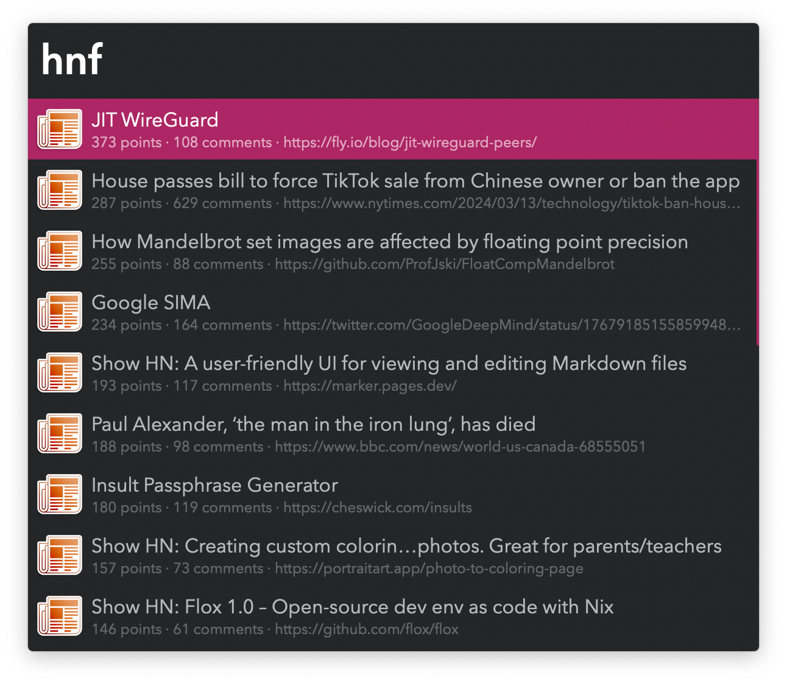
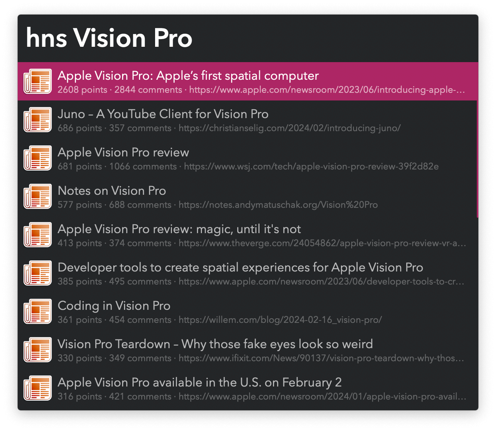

#  Hackerboard Alfred Workflow

Search and interact with Hacker News

[⤓ Install on the Alfred Gallery](https://alfred.app/workflows/vitor/hackerboard)

## Usage

Search the Hacker News front page via the `hnf` keyword.

Press <kbd>↩&#xFE0E;</kbd> to open the story’s website or <kbd>⌥</kbd><kbd>↩&#xFE0E;</kbd> to open the Hacker News comments thread. This behaviour can be reversed in the [Workflow’s Configuration](https://www.alfredapp.com/help/workflows/user-configuration/).

Seach stories with the `hns` keyword.

Previous shortcuts apply, plus <kbd>⌘</kbd><kbd>↩&#xFE0E;</kbd> switches between ordering by date (more recent first) and by relevance (then points, then number of comments).

Submit the frontmost browser tab with the `hnsubmit` keyword.

