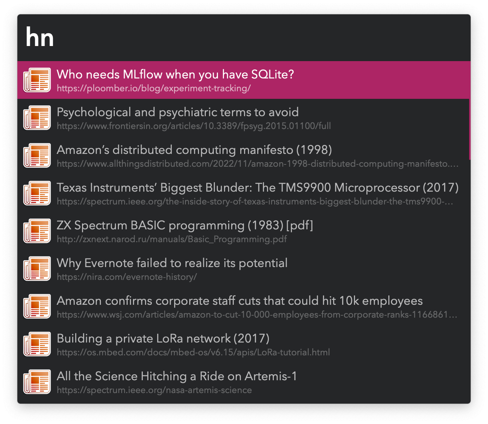

#  Hackerboard Alfred Workflow

Links from the front page of Hacker News

<a href='https://alfred.app/workflows/vitor/hackerboard'>⤓ Install From the Alfred Gallery</a>

## Usage

Search Hacker News front page links via the Hacker News Keyword (default: `hn`).

Press <kbd>⏎</kbd> to open the linked website or <kbd>⌥</kbd><kbd>⏎</kbd> to open the Hacker News comments thread. This behaviour can be reversed in the [Workflow’s Configuration](https://www.alfredapp.com/help/workflows/user-configuration/).

News are fetched if it’s been over an hour since the last run. If necessary, an immediate cache rebuild can be forced with the `:hackerboardforceupdate` keyword.
